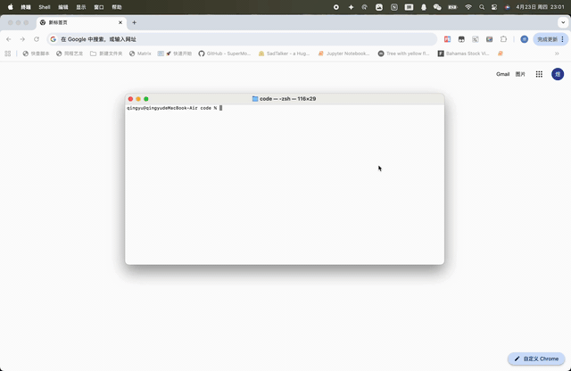
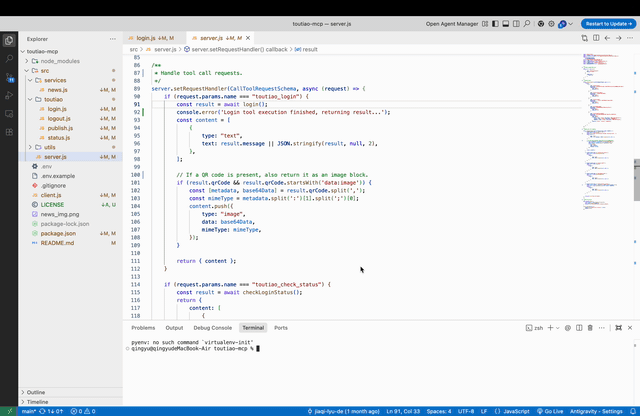
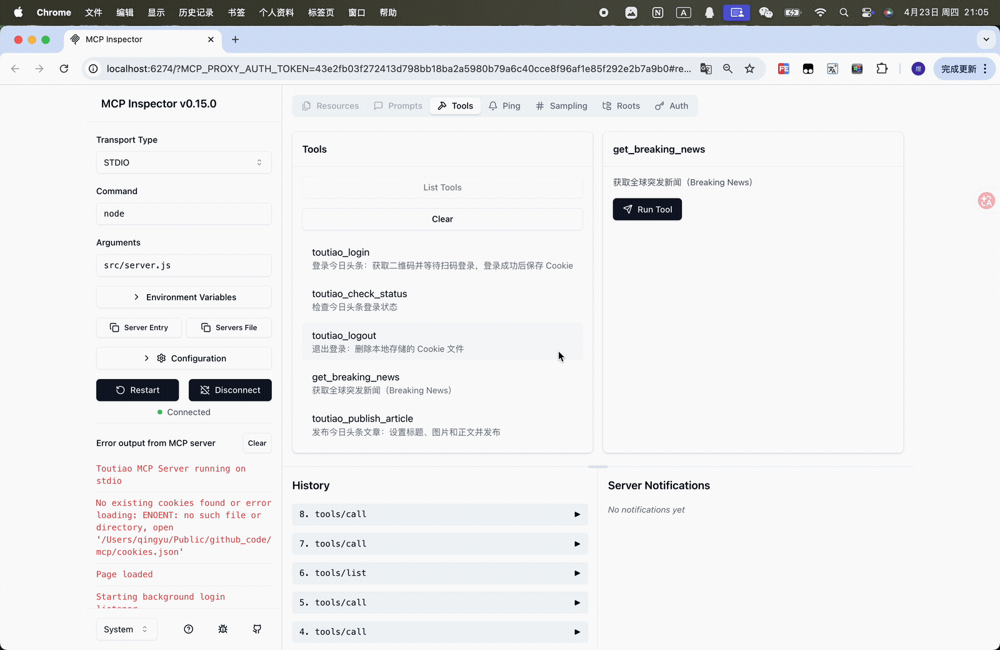
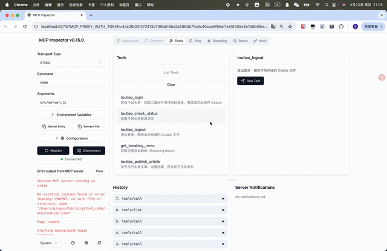

# toutiao-mcp

> 🌐 [English](#english) | [中文](#中文)

An MCP ([Model Context Protocol](https://modelcontextprotocol.io/)) server that automates a full pipeline:
**fetch global breaking news → publish to Toutiao (今日头条)**, orchestrated by any MCP-compatible AI client.

---

<a name="english"></a>

## English

### What this project does

[Toutiao (今日头条)](https://www.toutiao.com/) is a major content distribution platform in China. This project uses browser automation (Puppeteer) to help an AI assistant:

```
Event Registry API  ──▶  get_breaking_news  ──▶  toutiao_publish_article  ──▶  Toutiao
```

### Quick Start

Prerequisites: Node.js (recommended: current LTS).

1) Install dependencies

```bash
npm install
```

2) Configure environment variables

```bash
cp .env.example .env
```

Set your Event Registry API key (only required when using `source=eventregistry`):

```env
NEWS_API_KEY=your_event_registry_api_key
```

Optional: default news source for `get_breaking_news`:

```env
# eventregistry | hackernews
NEWS_SOURCE=hackernews
```

3) Run in MCP Inspector (recommended for debugging)

```bash
npm run inspect
```

### Project Overview

Main Features

**Publish Article demo (Codex)**



Prompt used for this demo:

```text
Please help me post a breaking news message on Toutiao,

and attach the following image: /Users/qingyu/Desktop/news_img.png

Please use toutiao-mcp to post. You can use toutiao-mcp's built-in skills to decide the article title and content yourself.
```

<details>
<summary><strong>1) QR Login (toutiao_login)</strong></summary>

Starts a visible browser, opens Toutiao, extracts the QR code, and watches login state in the background.

Demo GIF:



</details>

<details>
<summary><strong>2) Check Login Status (toutiao_check_status)</strong></summary>

Runs a headless browser to validate whether the current session is still logged in, and updates cookies if needed.

Demo GIF:


</details>

<details>
<summary><strong>3) Fetch Breaking News (get_breaking_news)</strong></summary>

Fetches breaking news from `eventregistry` (requires `NEWS_API_KEY`) or `hackernews` (no key required).

Demo GIF:



</details>

<details>
<summary><strong>4) Logout / Clear Cookies (toutiao_logout)</strong></summary>

Deletes the local `cookies.json` file to reset login state.

Demo GIF:



</details>

### MCP Tool List

| Tool | Description | Parameters |
| :--- | :--- | :--- |
| `toutiao_login` | Get QR code and wait for scan | — |
| `toutiao_check_status` | Check Toutiao login status | — |
| `toutiao_logout` | Delete local cookies file | — |
| `get_breaking_news` | Fetch breaking news (`eventregistry` or `hackernews`) | `source?`, `kind?`, `limit?`, `withDetails?` |
| `get_hackernews_stories` | Fetch Hacker News stories | `kind?`, `limit?`, `withDetails?` |
| `get_hackernews_item` | Fetch a Hacker News item by id | `id` |
| `toutiao_publish_article` | Publish a Toutiao article | `title`, `content`, `imagePath` |

### Claude Desktop integration

Add this to your `claude_desktop_config.json`:

```json
{
  "mcpServers": {
    "toutiao-mcp": {
      "command": "node",
      "args": ["/absolute/path/to/toutiao-mcp/src/server.js"],
      "env": {
        "NEWS_API_KEY": "your_api_key"
      }
    }
  }
}
```

### Notes & Troubleshooting

- Puppeteer downloads a Chromium binary on first run; make sure your network is available.
- `cookies.json` contains sensitive session tokens and is ignored by `.gitignore` by default. Do not commit it.
- `toutiao_publish_article` requires `imagePath` to exist locally (absolute path recommended).
- If Toutiao UI changes, selectors may break and require updates in `src/toutiao/publish.js`.

### Skill option (Hacker News)

If you prefer a skill-based workflow (instead of relying on a paid/limited news API), this repo vendors the Hacker News skill at:

- `skills/hackernews/SKILL.md`

Leave the fetching/curation to your agent using that skill, then publish via `toutiao_publish_article`.

### License

[ISC License](./LICENSE)

---
---

<a name="中文"></a>

## 中文

### 项目做什么

[今日头条 (Toutiao)](https://www.toutiao.com/) 是国内主要的内容分发平台之一。本项目通过 Puppeteer 浏览器自动化，让支持 MCP 的 AI 客户端可以完成：

```
Event Registry API  ──▶  get_breaking_news  ──▶  toutiao_publish_article  ──▶  今日头条
```

### 快速开始

环境要求：Node.js（建议使用 LTS 版本）。

1）安装依赖

```bash
npm install
```

2）配置环境变量

```bash
cp .env.example .env
```

在 `.env` 中配置 Event Registry API Key：

```env
NEWS_API_KEY=your_event_registry_api_key
```

可选：为 `get_breaking_news` 设置默认新闻来源：

```env
# eventregistry | hackernews
NEWS_SOURCE=hackernews
```

3）使用 MCP Inspector 调试（推荐）

```bash
npm run inspect
```

### 项目简介

主要功能

**发布文章演示（Codex）**


该演示使用的提示词：

```text
Please help me post a breaking news message on Toutiao,

and attach the following image: /Users/qingyu/Desktop/news_img.png

Please use toutiao-mcp to post. You can use toutiao-mcp's built-in skills to decide the article title and content yourself.
```

<details>
<summary><strong>1）扫码登录（toutiao_login）</strong></summary>

启动可见浏览器打开头条，提取二维码，并在后台监听登录状态变化。

GIF 演示：


</details>

<details>
<summary><strong>2）检查登录状态（toutiao_check_status）</strong></summary>

使用无头浏览器检测当前会话是否已登录，并在需要时更新 Cookie。

GIF 演示：


</details>

<details>
<summary><strong>3）获取突发新闻（get_breaking_news）</strong></summary>

从 `eventregistry`（需要 `NEWS_API_KEY`）或 `hackernews`（无需 key）获取突发新闻/科技新闻。

GIF 演示：


</details>

<details>
<summary><strong>4）退出登录 / 清理 Cookie（toutiao_logout）</strong></summary>

删除本地 `cookies.json`，重置登录状态。

GIF 演示：


</details>

### MCP 工具列表

| 工具 | 说明 | 参数 |
| :--- | :--- | :--- |
| `toutiao_login` | 获取登录二维码并等待扫码 | 无 |
| `toutiao_check_status` | 检查头条登录状态 | 无 |
| `toutiao_logout` | 删除本地 cookies 文件 | 无 |
| `get_breaking_news` | 获取突发新闻（支持 `eventregistry` 或 `hackernews`） | `source?`, `kind?`, `limit?`, `withDetails?` |
| `get_hackernews_stories` | 获取 Hacker News 故事列表 | `kind?`, `limit?`, `withDetails?` |
| `get_hackernews_item` | 根据 id 获取 Hacker News 条目 | `id` |
| `toutiao_publish_article` | 发布头条文章 | `title`, `content`, `imagePath` |

### Claude Desktop 集成

将以下内容添加至 `claude_desktop_config.json`：

```json
{
  "mcpServers": {
    "toutiao-mcp": {
      "command": "node",
      "args": ["/绝对路径/到/toutiao-mcp/src/server.js"],
      "env": {
        "NEWS_API_KEY": "your_api_key"
      }
    }
  }
}
```

### 注意事项与排错

- Puppeteer 首次运行会下载 Chromium 内核，请确保网络通畅。
- `cookies.json` 含敏感会话令牌，默认已加入 `.gitignore`，请勿提交到仓库。
- `toutiao_publish_article` 需要本地存在的 `imagePath`（建议使用绝对路径）。
- 若头条页面结构变更导致选择器失效，可从 `src/toutiao/publish.js` 开始排查与修复。

### Skill 用法（Hacker News）

如果你希望不用第三方新闻 API，而改用 “skill 驱动” 的方式拉取/筛选科技新闻，本仓库已内置 Hacker News skill：

- `skills/hackernews/SKILL.md`

你可以让 AI 先用该 skill 获取/整理内容，再调用 `toutiao_publish_article` 发布。

### 开源协议

[ISC License](./LICENSE)
